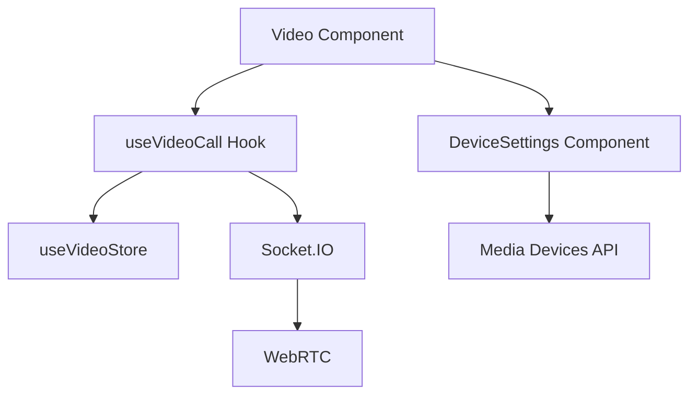

# 영상통화 기능 개발 가이드

## 목차
1. [개요](#개요)
2. [아키텍처](#아키텍처)
3. [컴포넌트 구조](#컴포넌트-구조)
4. [상태 관리](#상태-관리)
5. [API 및 이벤트](#api-및-이벤트)
6. [에러 처리](#에러-처리)
7. [테스트 가이드](#테스트-가이드)

## 개요

영상통화 기능은 WebRTC와 Socket.IO를 기반으로 구현되었습니다. 주요 기능은 다음과 같습니다:

- 1:1 영상통화
- 디바이스 설정 (카메라/마이크 선택)
- 통화 품질 모니터링
- 자동 재연결
- 리소스 관리

## 아키텍처



### 기술 스택
- WebRTC: P2P 연결 및 미디어 스트림 처리
- Socket.IO: 시그널링 서버 통신
- Zustand: 상태 관리
- TypeScript: 타입 안정성

## 컴포넌트 구조

### Video 컴포넌트
- 메인 비디오 컴포넌트
- 로컬/원격 비디오 스트림 표시
- 통화 제어 UI (시작/종료/토글)
- 디바이스 설정 통합

### DeviceSettings 컴포넌트
- 카메라/마이크 선택 UI
- 디바이스 변경 처리
- 실시간 디바이스 감지

### useVideoCall Hook
- WebRTC 연결 관리
- 소켓 이벤트 처리
- 미디어 스트림 초기화
- 에러 처리

## 상태 관리

### VideoCallStatus
```typescript
type VideoCallStatus =
  | "idle"        // 초기 상태
  | "requesting"  // 통화 요청 중
  | "incoming"    // 수신 통화
  | "connecting"  // 연결 중
  | "connected"   // 연결됨
  | "reconnecting"// 재연결 중
  | "failed"      // 연결 실패
  | "rejected"    // 통화 거절됨
  | "ended";      // 통화 종료
```

### 주요 상태
- isVideoEnabled: 비디오 활성화 상태
- isAudioEnabled: 오디오 활성화 상태
- participants: 참가자 수
- selectedDevices: 선택된 디바이스 정보

## API 및 이벤트

### 소켓 이벤트
- offer: 통화 요청
- answer: 통화 응답
- ice-candidate: ICE 후보 교환
- call-rejected: 통화 거절
- call-ended: 통화 종료
- device-settings-updated: 디바이스 설정 변경
- call-quality-metrics: 품질 메트릭 전송

### WebRTC API
- createOffer/createAnswer: SDP 생성
- setLocalDescription/setRemoteDescription: SDP 설정
- addIceCandidate: ICE 후보 추가
- getStats: 통화 품질 통계

## 에러 처리

### 주요 에러 케이스
1. 디바이스 접근 실패
```typescript
try {
  await navigator.mediaDevices.getUserMedia({...});
} catch (error) {
  if (error instanceof DOMException) {
    if (error.name === "NotAllowedError") {
      // 권한 거부
    } else if (error.name === "NotFoundError") {
      // 디바이스 없음
    }
  }
}
```

2. 연결 실패
```typescript
peerConnection.oniceconnectionstatechange = () => {
  switch (peerConnection.iceConnectionState) {
    case "failed":
      // 연결 실패 처리
      break;
    case "disconnected":
      // 재연결 시도
      break;
  }
};
```

3. 품질 저하
```typescript
if (packetLossRate > 15 || roundTripTime > 1000) {
  // 심각한 품질 저하 처리
}
```

## 테스트 가이드

### 단위 테스트
- 컴포넌트 렌더링
- 상태 변경
- 이벤트 핸들러

### 통합 테스트
- 통화 연결/종료 시나리오
- 디바이스 변경
- 에러 상황

### E2E 테스트
1. 기본 시나리오
   - 통화 시작 → 연결 → 종료
   - 디바이스 변경 → 스트림 업데이트
   - 네트워크 불안정 → 재연결

2. 엣지 케이스
   - 권한 거부
   - 디바이스 없음
   - 통화 중 새로고침
   - 백그라운드 전환

### 성능 테스트
- 메모리 누수 체크
- CPU 사용량 모니터링
- 네트워크 트래픽 분석 